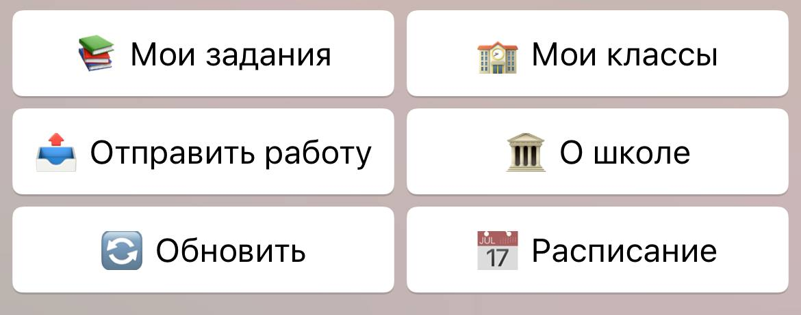
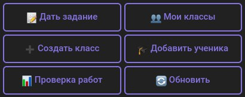
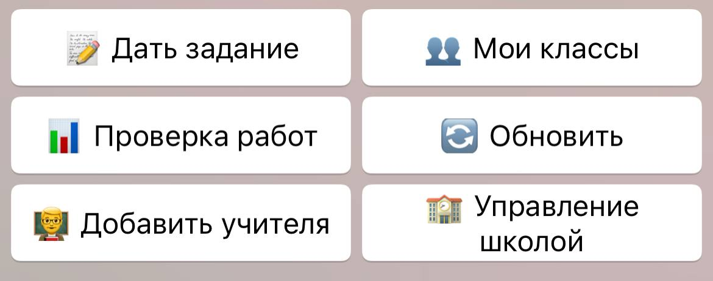
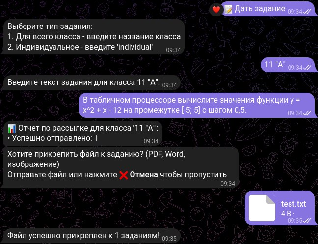

# 🏫 School Bot - Учебный Telegram-бот


Бот для автоматизации учебного процесса с удобным интерфейсом для учителей и учеников.

## ✨ Возможности
- 📝 Назначение заданий всему классу или отдельным ученикам
- 📊 Проверка и оценка присланных работ
- 🔄 Интуитивное inline-меню с навигацией
- ⏱ Экономия времени на организацию учебного процесса

## 🛠 Установка

1. Клонировать репозиторий:
```bash
git clone https://github.com/andrew-olegovi4/school_bot.git
cd school_bot
```

2. Установить зависимости:

```bash
pip install pip-tools
pip-compile
pip-sync
```
3. Настроить конфигурацию:

```bash
cp school_bot/config.example.py school_bot/config.py
# Затем отредактировать config.py, добавив токен бота и username директора
```

4. Запустить бота:

```bash
python main.py
```

## 📌 Примеры использования

<figure>
  
  <figcaption>Меню для учащихся</figcaption>
</figure>
<figure>
  
  <figcaption>Меню для преподавателей</figcaption>
</figure>
<figure>
  
  <figcaption>Административное меню</figcaption>
</figure>
<figure>
  
  <figcaption>Назначение задания</figcaption>
</figure>

## 🤝 Участие в разработке

PR приветствуются! Для крупных изменений сначала откройте issue.

## 📄 TODO List

- [ ] Добавить возможность комментирования оценки учеником
- [ ] Реализовать функционал удаления заданий
- [ ] Добавить возможность удаления учителей
- [ ] Внедрить указание дедлайна для заданий

## 📄 Лицензия

MIT